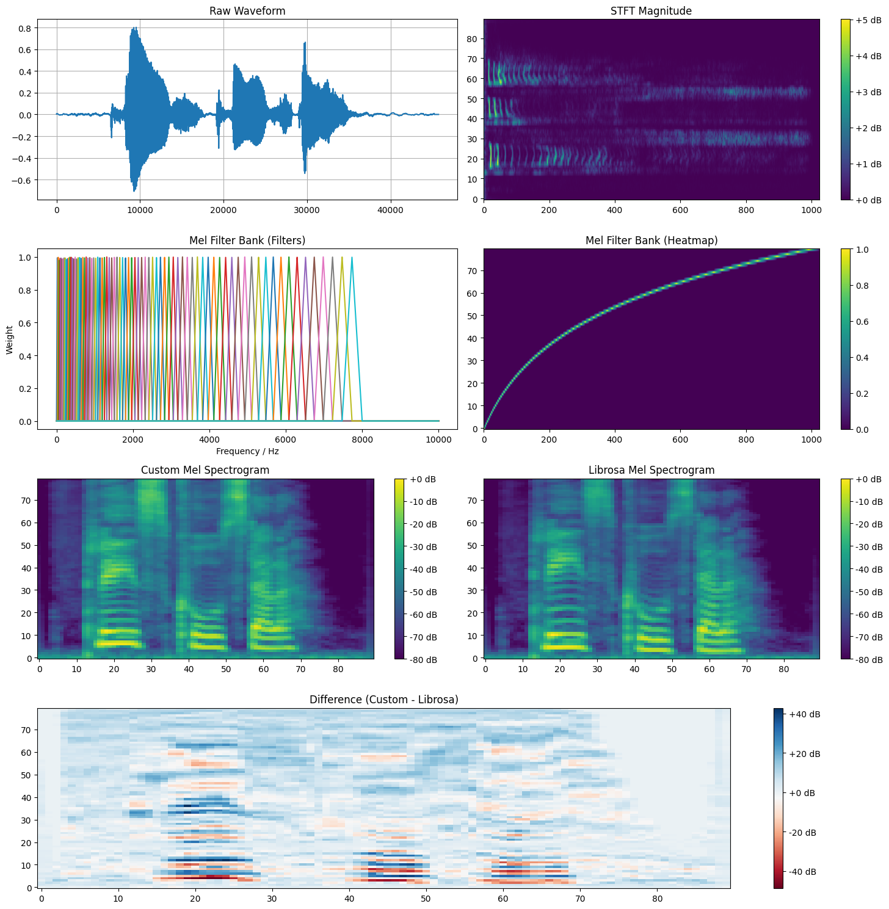

# Audio-AI study repository

# Melspectrogram from scratch VS Librosa

- One file insights:
    - STFT shape: (90, 1025)
    - Power spec shape: (90, 1025)
    - Mel filter shape: (80, 1025)
    - Final mel shape: (90, 80)
    - Audio length: 45749
    - Custom mel shape: (80, 90)
    - Librosa mel shape: (80, 90)

- Processing Times:
    - Custom Implementation: 0.151 seconds
    - Librosa Implementation: 0.006 seconds

- Shape Comparison:
    - Custom Mel Spectrogram Shape: (80, 90)
    - Librosa Mel Spectrogram Shape: (80, 90)

- Value Range Comparison:
    - Custom Mel Spectrogram Range: [-80.00, 0.00]
    - Librosa Mel Spectrogram Range: [-80.00, 0.00]

- Difference Statistics:
    - Mean Absolute Difference: 5.9177
    - Max Absolute Difference: 48.7916
    - Standard Deviation of Difference: 7.7598
 
 

